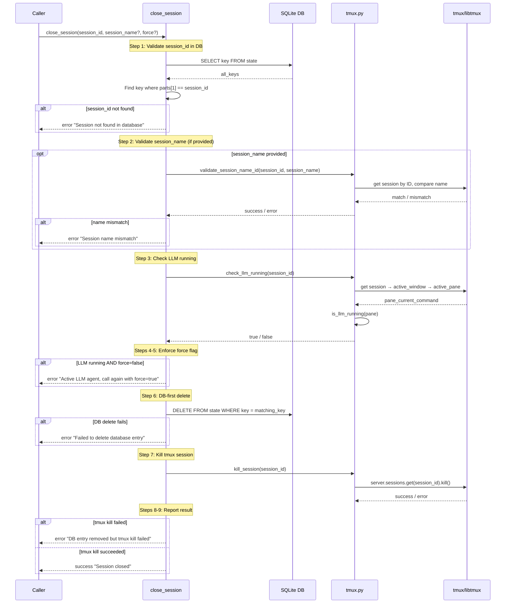

# close_session Architecture

## Overview

`close_session` is an MCP tool that terminates a waggle-managed tmux session and removes its corresponding database entry. It provides a controlled teardown path with safety checks: DB-existence validation, optional name disambiguation, and LLM-running protection (requiring explicit `force=true` to kill a session with an active agent).

Defined in `src/waggle/server.py`. Delegates tmux operations to `src/waggle/tmux.py`.

## Parameters

| Parameter | Type | Required | Default | Description |
|-----------|------|----------|---------|-------------|
| `session_id` | `str` | Yes | — | tmux session ID (e.g. `"$1"`) |
| `session_name` | `str \| None` | No | `None` | Optional name to validate against — prevents closing the wrong session if IDs have been recycled |
| `force` | `bool` | No | `False` | If `True`, close even when an LLM agent is actively running |

## DB-First Cleanup Ordering

The DB entry is deleted **before** the tmux session is killed. This ordering is intentional:

- **DB is the source of truth** for waggle. Removing the entry first ensures `list_agents` and other DB-reading tools immediately stop reporting the session, even if the tmux kill takes time or fails.
- **Partial failure is safe.** If the DB delete succeeds but the tmux kill fails, the result is an orphaned tmux session with no waggle tracking — a benign state. The caller is informed and can use raw tmux commands to clean up.
- **Reverse ordering is worse.** If tmux were killed first and the DB delete failed, waggle would have a dangling DB entry pointing at a dead session — a state that confuses `list_agents` until `cleanup_dead_sessions` runs.

## LLM Protection

Prevents accidental termination of sessions with active LLM agents (SR-8).

**Detection method** (`tmux.py:is_llm_running`):
- Reads `pane_current_command` from the session's active pane via libtmux
- Returns `True` if the command is `claude` or `opencode` (case-insensitive)
- Single tmux query — no process tree walking, no pgrep/psutil (SR-8.1)
- Returns `False` on any error (fail-open for detection, fail-closed for protection)

**Async wrapper** (`tmux.py:check_llm_running`):
- Offloads the synchronous libtmux call to a thread via `asyncio.to_thread`
- Resolves session by ID, gets active window's active pane, calls `is_llm_running`

**Protection flow:**
- If LLM is running and `force=False`: return error prompting caller to retry with `force=True`
- If LLM is running and `force=True`: proceed with teardown
- If LLM is not running: proceed regardless of `force` value

## Error Conditions

| Condition | Step | Response |
|-----------|------|----------|
| DB query fails | 1 | `{status: "error", message: "Failed to query database: ..."}` |
| `session_id` not in DB | 1 | `{status: "error", message: "Session '$id' not found in database"}` |
| `session_name` doesn't match tmux | 2 | `{status: "error", message: "Session name mismatch: expected '...', found '...'"}` |
| LLM running, `force=false` | 4-5 | `{status: "error", message: "Active LLM agent, call again with force=true to confirm"}` |
| DB delete fails | 6 | `{status: "error", message: "Failed to delete database entry: ..."}` |
| tmux kill fails after DB delete | 7-8 | `{status: "error", message: "DB entry removed but tmux session kill failed: ..."}` |

## Return Contract

```
{"status": "success" | "error", "message": str}
```

On success: `{"status": "success", "message": "Session closed"}`

On error: `{"status": "error", "message": "<description>"}` — message varies by error condition (see table above).

## Sequence Diagram


