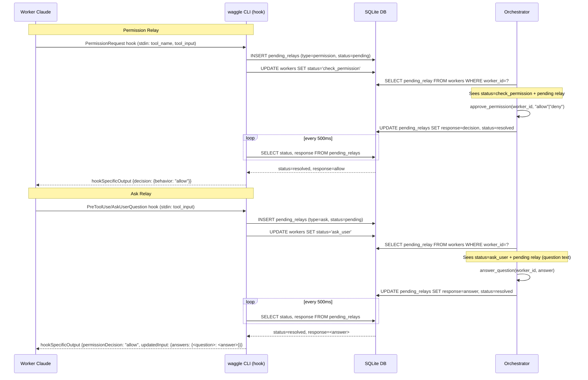

# Relay Architecture

## Overview

Workers never block at TUI prompts. When a worker needs a permission decision or needs to ask the user a question, the request is intercepted by a Claude hook, written to the `pending_relays` table, and the worker's status is updated so the orchestrator can detect and resolve it. The CLI command long-polls the database until a response arrives or the timeout expires, then prints `hookSpecificOutput` JSON to stdout for Claude to consume.

Implemented in `src/waggle/cli.py` (hook handlers) and `src/waggle/engine.py` (orchestrator-side resolution).

## Parameters

### approve_permission

| Parameter | Type | Required | Description |
|-----------|------|----------|-------------|
| `worker_id` | `str` | Yes | UUID of the worker with the pending permission request |
| `decision` | `str` | Yes | `"allow"` or `"deny"` |

### answer_question

| Parameter | Type | Required | Description |
|-----------|------|----------|-------------|
| `worker_id` | `str` | Yes | UUID of the worker with the pending question |
| `answer` | `str` | Yes | Freeform answer text to deliver to the worker |

## Permission Relay (§5.1)

1. **PermissionRequest hook fires** — Claude triggers `waggle permission-request`, passing hook data via stdin
2. **CLI reads stdin + resolves worker** — reads `tool_name` and `tool_input` from hook data; gets `WAGGLE_WORKER_ID` from the tmux environment
3. **Insert relay row** — writes a `pending_relays` row with `relay_type='permission'`, `status='pending'`, and serialized `details`; sets `workers.status='check_permission'`
4. **Long-poll** — polls DB every 500ms for the relay row to reach `status='resolved'`
5. **Orchestrator resolves** — orchestrator calls `approve_permission(worker_id, decision)` via MCP; engine sets `response=decision`, `status='resolved'`
6. **CLI prints hookSpecificOutput** — emits allow or deny JSON to stdout and exits 0

## Ask Relay (§5.2)

1. **PreToolUse/AskUserQuestion hook fires** — Claude triggers `waggle ask-relay` with hook data via stdin
2. **CLI reads stdin + resolves worker** — reads `tool_input` (including `question`) from hook data; gets `WAGGLE_WORKER_ID` from tmux environment
3. **Insert relay row** — writes a `pending_relays` row with `relay_type='ask'`, `status='pending'`, and serialized `tool_input`; sets `workers.status='ask_user'`
4. **Long-poll** — polls DB every 500ms for the relay row to reach `status='resolved'`
5. **Orchestrator resolves** — orchestrator calls `answer_question(worker_id, answer)` via MCP; engine sets `response=answer`, `status='resolved'`
6. **CLI prints hookSpecificOutput** — emits allow JSON with `updatedInput.answers` populated, then exits 0

## pending_relays Table

| Column | Type | Description |
|--------|------|-------------|
| `relay_id` | TEXT PK | UUID for this relay |
| `worker_id` | TEXT | Worker that created the relay |
| `relay_type` | TEXT | `'permission'` or `'ask'` |
| `details` | TEXT | JSON-serialized request details |
| `response` | TEXT | Resolution value written by orchestrator |
| `status` | TEXT | `'pending'`, `'resolved'`, or `'timeout'` |
| `created_at` | TIMESTAMP | Row creation time |
| `resolved_at` | TIMESTAMP | Time the relay was resolved |

## Long-Poll Mechanism

The CLI loops with a 500ms sleep between each iteration, querying:

```sql
SELECT status, response FROM pending_relays WHERE relay_id = ?
```

When `status = 'resolved'`, the CLI constructs and prints the appropriate `hookSpecificOutput` JSON.

## Timeout

Configured via `relay_timeout_seconds` in `~/.waggle/config.json` (default: 3600). When the elapsed time exceeds the timeout:

1. CLI updates `pending_relays SET status = 'timeout'`
2. CLI prints a deny `hookSpecificOutput` (permission relay) or `permissionDecision: "deny"` (ask relay)
3. CLI exits 0

## hookSpecificOutput JSON Formats

**Permission allow:**
```json
{"hookSpecificOutput": {"hookEventName": "PermissionRequest", "decision": {"behavior": "allow"}}}
```

**Permission deny (orchestrator or timeout):**
```json
{"hookSpecificOutput": {"hookEventName": "PermissionRequest", "decision": {"behavior": "deny", "message": "Denied by orchestrator"}}}
```

**Ask answer:**
```json
{"hookSpecificOutput": {"hookEventName": "PreToolUse", "permissionDecision": "allow", "updatedInput": {"answers": {"<question>": "<answer>"}}}}
```

**Ask timeout:**
```json
{"hookSpecificOutput": {"hookEventName": "PreToolUse", "permissionDecision": "deny"}}
```

## Errors

| Error | Condition |
|-------|-----------|
| `worker_not_found` | `worker_id` not in DB, or `caller_id` doesn't match |
| `no_pending_permission` | Worker exists but has no pending permission relay |
| `no_pending_question` | Worker exists but has no pending ask relay |

## v1 Replacement Note

Replaces v1's manual tmux TUI interaction for permissions, where the orchestrator would send keystrokes to a tmux pane to navigate the Claude TUI. v2 uses no tmux interaction for relay resolution — decisions are written directly to the database and picked up by the blocking CLI hook process.

## Sequence Diagram


