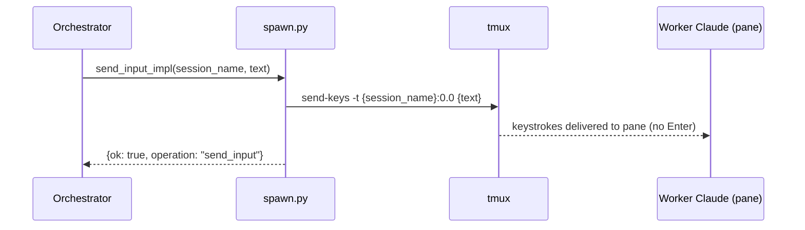

# send_input Architecture

## Overview

`send_input` delivers freeform text to a running worker via `tmux send-keys`. No implicit Enter is appended — the caller controls when Enter is sent.

Implemented in `src/claude_spawn/spawn.py` as `send_input_impl()`. All tmux calls go through the `_tmux(argv)` seam.

## Parameters

| Parameter | Type | Required | Description |
|-----------|------|----------|-------------|
| `session_name` | `str` | Yes | tmux session name of the target worker |
| `text` | `str` | Yes | Text to deliver to window 0, pane 0 |

## Flow

1. **Send via tmux** — `tmux send-keys -t {session_name}:0.0 {text}` (no Enter key)
2. **Return** `{ok: true, operation: "send_input"}`

## Errors

| err_name | Condition |
|----------|-----------|
| `ErrTmuxSendKeys` | `tmux send-keys` exits non-zero |

## Return Contract

On success:

```json
{"ok": true, "operation": "send_input"}
```

## Sequence Diagram


