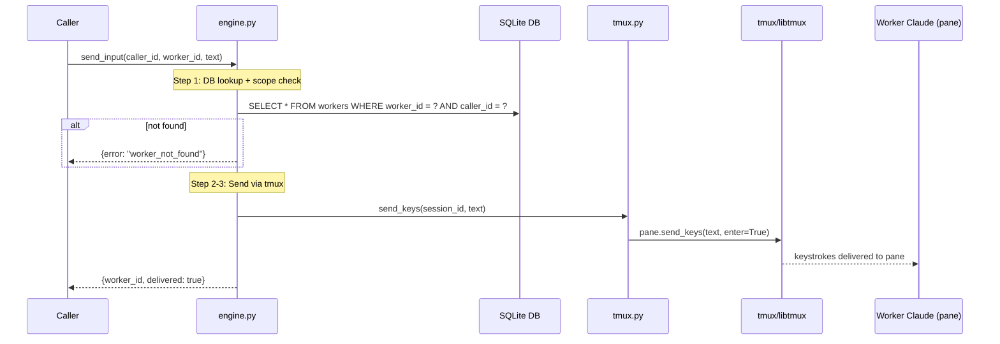

# send_input Architecture

## Overview

`send_input` delivers freeform text to a running worker via `tmux send-keys`. It writes the text directly to the worker's tmux pane, simulating keyboard input so the text appears at the Claude prompt.

Defined in `src/waggle/engine.py`. Delivery is handled via `src/waggle/tmux.py`.

## Parameters

| Parameter | Type | Required | Default | Description |
|-----------|------|----------|---------|-------------|
| `worker_id` | `str` | Yes | — | UUID of the target worker |
| `text` | `str` | Yes | — | Freeform text to deliver to the worker |

## Flow

1. **DB lookup + caller scope check** — find worker by `worker_id`; return `worker_not_found` if not present or caller doesn't own it
2. **Resolve session** — get `session_id` from the worker row
3. **Send via tmux** — call `tmux.send_keys(session_id, text)` which issues `tmux send-keys` to the worker's pane, followed by `Enter`
4. **Return** `{worker_id, delivered: true}`

## Errors

| Error | Condition |
|-------|-----------|
| `worker_not_found` | `worker_id` not in DB, or `caller_id` doesn't match |
| tmux delivery error (runtime) | `tmux.send_keys` fails (e.g. session was killed); returns `{"error": "<tmux error message>"}` |

## Return Contract

On success:

```json
{"worker_id": "<uuid>", "delivered": true}
```

## Sequence Diagram


