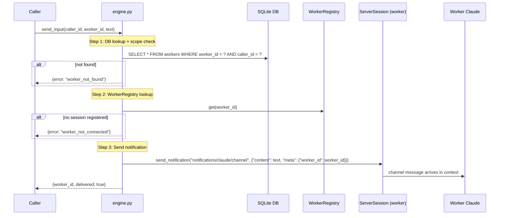

# send_input Architecture

## Overview

`send_input` delivers freeform text to a running worker via the Claude Channels notification mechanism. It requires no tmux interaction and performs no TUI navigation — the text arrives in the worker Claude's context as a channel message.

Defined in `src/waggle/engine.py`. Delivery is handled via the worker's registered `ServerSession` in `WorkerRegistry`.

## Parameters

| Parameter | Type | Required | Default | Description |
|-----------|------|----------|---------|-------------|
| `worker_id` | `str` | Yes | — | UUID of the target worker |
| `text` | `str` | Yes | — | Freeform text to deliver to the worker |

> **Note:** There is no `pane_id`, `session_id`, or `custom_text` parameter. Those were v1 concepts tied to tmux-based delivery.

## Flow

1. **DB lookup + caller scope check** — find worker by `worker_id`; return `worker_not_found` if not present or caller doesn't own it
2. **WorkerRegistry lookup** — resolve the worker's `ServerSession` from the in-memory registry; return `worker_not_connected` if no session is registered
3. **Send notification** — call `ServerSession.send_notification("notifications/claude/channel", {"content": text, "meta": {"worker_id": worker_id}})` 
4. **Return** `{worker_id, delivered: true}`

## Worker Registration

Workers connect to the waggle worker MCP server (port `8423`) using the `?worker_id={uuid}` query parameter embedded in their per-worker MCP config. Registration is automatic: `WorkerRegistrationMiddleware` intercepts the `tools/list` request that fires during MCP client initialization and stores the active `ServerSession` in `WorkerRegistry`. No explicit tool call is required. The `register_worker` tool still exists as a fallback but is no longer the primary registration path.

See `spawn_worker.md` for how the per-worker MCP config is written at spawn time.

## Errors

| Error | Condition |
|-------|-----------|
| `worker_not_found` | `worker_id` not in DB, or `caller_id` doesn't match |
| `worker_not_connected` | Worker exists in DB but has no registered session in `WorkerRegistry` |

## Return Contract

On success:

```json
{"worker_id": "<uuid>", "delivered": true}
```

## v1 Replacement Note

This replaces v1's `send_command` tool, which sent keystrokes to a tmux pane to navigate the Claude TUI. v2 uses no tmux interaction for input delivery — text is pushed directly to the worker's Claude Channels session via MCP notification.

## Sequence Diagram


