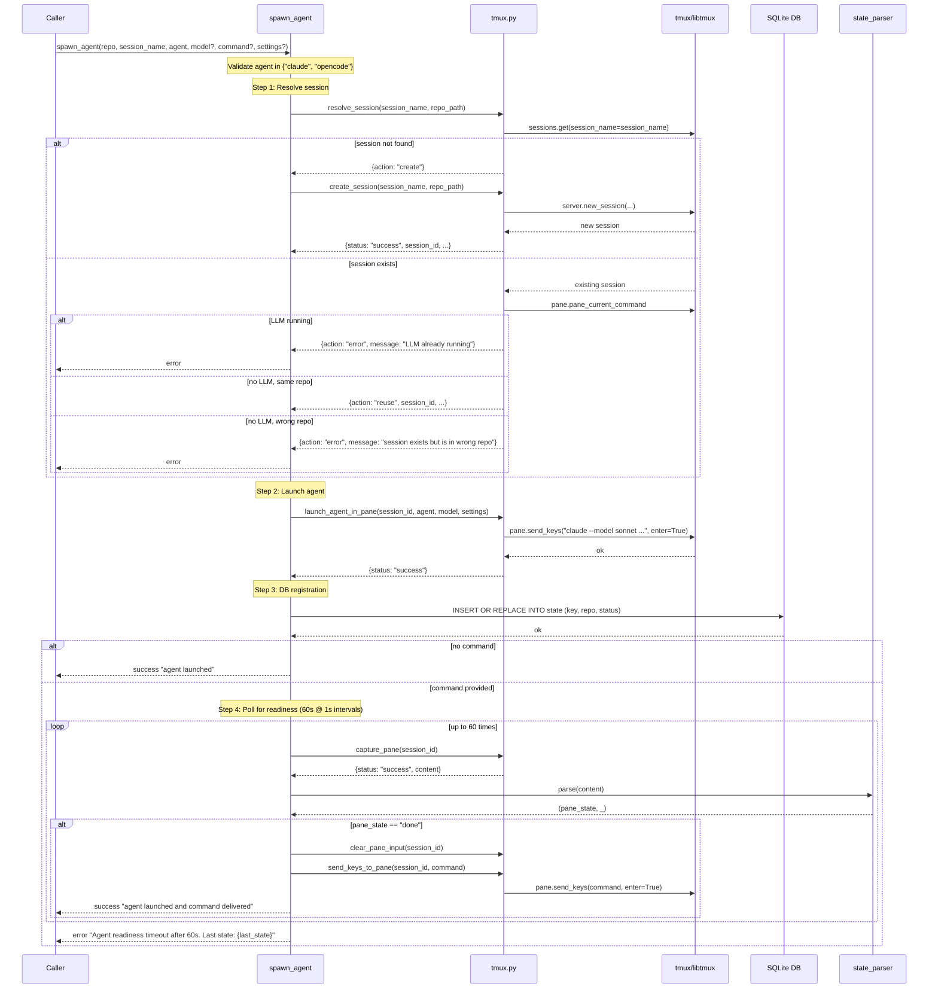

# spawn_agent Architecture

## Overview

`spawn_agent` is an MCP tool that programmatically launches a Claude or OpenCode agent in a tmux session. It handles session resolution (create vs. reuse), agent launch, DB registration, and optional command delivery with readiness polling.

Defined in `src/waggle/server.py`. Delegates tmux operations to `src/waggle/tmux.py`.

## Parameters

| Parameter | Type | Required | Default | Description |
|-----------|------|----------|---------|-------------|
| `repo` | `str` | Yes | — | Absolute path to the repository directory |
| `session_name` | `str` | Yes | — | tmux session name to create or reuse |
| `agent` | `str` | Yes | — | Agent binary: `"claude"` or `"opencode"` |
| `model` | `str \| None` | No | `None` | Optional model name (e.g. `"sonnet"`, `"haiku"`, `"opus"`) |
| `command` | `str \| None` | No | `None` | Initial command to deliver after agent reaches ready state |
| `settings` | `str \| None` | No | `None` | Extra CLI flags (e.g. `"--dangerously-skip-permissions"`) |

## Session Resolution Logic (SR-6.2)

Four cases are handled in order:

| Case | Condition | Action |
|------|-----------|--------|
| 1 | Session name doesn't exist | Create new session at `repo` path |
| 2 | Session exists + LLM running | Error: `"LLM already running in session"` |
| 3 | Session exists + no LLM + same repo | Reuse existing session |
| 4 | Session exists + no LLM + different repo | Error: `"session exists but is in wrong repo"` |

Path comparison uses `Path.resolve()` for normalization — symlinks and relative paths are resolved before comparing.

## tmux.py Session Functions

### `resolve_session(session_name, repo_path)`

Async wrapper over `_resolve_session_sync`. Implements the 4-case logic above.

- Uses `server.sessions.get(session_name=session_name)` — exception on miss → case 1
- Uses `is_llm_running(pane)` (checks `pane_current_command`) for LLM detection (SR-8)
- Compares `Path(session.session_path).resolve()` with `Path(repo_path).resolve()`
- Returns `{action: "create" | "reuse" | "error", ...}`

### `create_session(session_name, repo_path)`

Async wrapper over `_create_session_sync`.

- Calls `server.new_session(session_name=..., start_directory=..., attach=False)`
- Returns `{status, session_id, session_name, session_created}` on success

### `launch_agent_in_pane(session_id, agent, model, settings)`

Async wrapper over `_launch_agent_in_pane_sync`.

- Resolves session by ID, gets active pane
- Constructs CLI command: `"{agent} [--model {model}] [{settings}]"`
- Calls `pane.send_keys(cmd, enter=True)` to launch the agent

## DB Registration (SR-6.5)

After session creation and agent launch, waggle registers the session in its SQLite DB:

```sql
INSERT OR REPLACE INTO state (key, repo, status, updated_at)
VALUES ("{session_name}+{session_id}+{session_created}", "{repo_path}", "working", "now")
```

This happens **before** command delivery. If the agent fails after registration, the stale entry is cleaned up by `cleanup_dead_sessions` on the next run.

## Command Delivery (SR-6.3)

### Without command

Returns immediately after launch with `{status: "success", message: "agent launched"}`.

### With command

After launch and DB registration, polls the pane at 1-second intervals for up to 60 seconds:

1. `capture_pane(session_id)` — read current pane content
2. `state_parser.parse(content)` — detect agent state
3. If `done`: send command via `clear_pane_input` then `send_keys_to_pane`
4. If still not `done` after 60s: return error with last known state

**Timeout message**: `"Agent readiness timeout after 60s. Last state: {last_state}"`

## Return Contract (SR-6.4)

All return paths use:

```json
{
  "status": "success" | "error",
  "session_id": "str | null",
  "session_name": "str",
  "message": "str"
}
```

## Error Conditions

| Condition | Response |
|-----------|----------|
| Invalid `agent` value | `{status: "error", session_id: null, message: "invalid agent '...'; must be 'claude' or 'opencode'"}` |
| Session resolution error | `{status: "error", session_id: null, message: resolution["message"]}` |
| `create_session` fails | `{status: "error", session_id: null, message: ...}` |
| `launch_agent_in_pane` fails | `{status: "error", session_id: session_id, message: ...}` |
| DB registration fails | `{status: "error", session_id: session_id, message: "Failed to register agent in database: ..."}` |
| Readiness timeout | `{status: "error", session_id: session_id, message: "Agent readiness timeout after 60s. Last state: {state}"}` |

## Sequence Diagram


