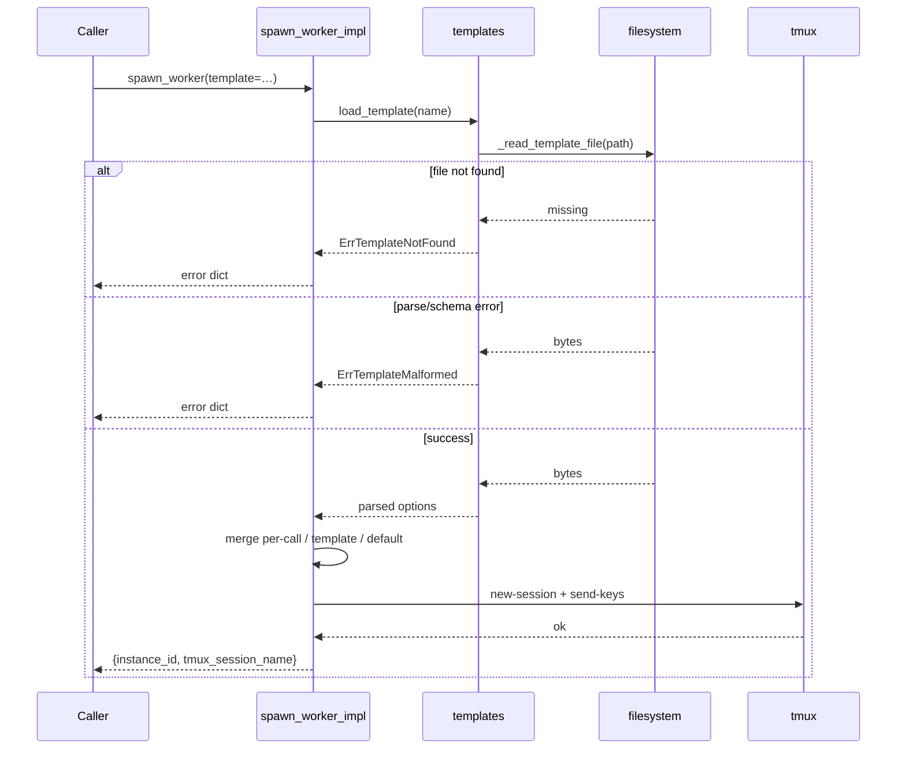

# Option Resolution and Templates Architecture

## Overview

`spawn_worker` supports a `template=<name>` argument that loads a TOML file
from a well-known directory and merges its option values into the call. This
document covers the storage layout, resolution order, merge semantics, loader
module design, and error catalogue for the templates feature.

Implemented in `src/claude_spawn/templates.py` (loader) and
`src/claude_spawn/spawn.py` (resolution and merge).

## Storage layout

Templates are stored as TOML files under `~/.claude-spawn/templates/`. The
filename stem is the template name:

```
~/.claude-spawn/templates/<name>.toml
```

For example, a template named `orchestrator` lives at
`~/.claude-spawn/templates/orchestrator.toml`. The directory is not created
automatically; if it is absent, `load_template` returns `ErrTemplateNotFound`.

## Option-resolution order

When `template=<name>` is supplied, each option is resolved through three
layers in priority order:

1. **Per-call value** — any non-`None` argument passed directly to
   `spawn_worker`. Always wins.
2. **Template field** — the corresponding key from the loaded TOML file. Used
   when the per-call argument is `None`.
3. **SR-1.3 default** — applied after merge when neither source supplies a
   value.

When `template=` is **not** supplied, the loader is never called and the
templates directory is never read.

**SR-1.3 fallback categories:**

| Category | Parameters |
|----------|------------|
| Required (no fallback) | `cwd` |
| Hardcoded by Claude Spawn | `tmux_session_name`, `instance_id`, `extra_env`, `claude_status_labels`, `claude_args`, `permissions` |
| Inherits Claude Code default | `model`, `thinking`, `claude_home`, `claude_settings` |

## Merge semantics

Three merge rules apply after the loader returns a parsed option-map:

### Rule 1 — Scalars and lists: wholesale replacement

For scalar options (`cwd`, `model`, `thinking`, `tmux_session_name`,
`instance_id`, `claude_home`, `claude_settings`) and the list option
(`claude_args`): if the per-call argument is not `None`, it replaces the
template value entirely. If the per-call argument is `None`, the template value
is used as-is.

Example: template sets `model = "sonnet"`; caller passes `model="opus"` →
effective model is `"opus"`.

### Rule 2 — Maps: shallow union

For map options (`extra_env`, `claude_status_labels`, `permissions`): template
keys form the base; per-call entries are layered on top; per-call wins on any
colliding top-level key. A per-call empty `{}` still enters the merge path, so
template-only keys survive. The result is always a `dict`, never `None`.

Example: template `extra_env = {LOG_LEVEL = "info"}` plus per-call
`extra_env={"TRACE": "1"}` → `{LOG_LEVEL: "info", TRACE: "1"}`.

### Rule 3 — Permissions sub-keys: independent replacement

Because `permissions` uses the map merge rule, each sub-key (`allow`, `deny`,
`ask`) is an independent top-level key. A per-call `permissions` dict that
contains only `deny` replaces the template's `deny` list while leaving the
template's `allow` and `ask` lists intact.

Example: template `permissions = {allow = ["Bash(git *)"]}` plus per-call
`permissions={"deny": ["Bash(rm -rf *)"]}` → effective
`{allow: ["Bash(git *)"], deny: ["Bash(rm -rf *)"]}`.

## Loader module

**Module:** `src/claude_spawn/templates.py`

### Public API

| Symbol | Kind | Description |
|--------|------|-------------|
| `load_template(name)` | function | Resolve, read, and validate one template by name. Returns an SR-7.1 result dict. |
| `enumerate_templates()` | generator | Yield `(name, path, result)` for every `.toml` file in the templates directory. |

### Filesystem seams

Two private functions are the only entry-points for filesystem access. Tests
patch both via `unittest.mock.patch`:

| Patch target | Description |
|--------------|-------------|
| `claude_spawn.templates._templates_dir` | Returns `~/.claude-spawn/templates` (expanded). |
| `claude_spawn.templates._read_template_file` | Reads and returns the raw text of one template file. |

### Import inertia

`import claude_spawn.templates` performs no filesystem reads. Both seams are
called only from the public functions, never at module level.

## Load-time validation

`load_template` rejects a file and returns `ErrTemplateMalformed` for any of
the following conditions (SR-6.4):

- TOML parse error in the file.
- The `template` key is present (templates cannot reference other templates,
  SR-2.4).
- An unknown key is present (any key not in the 11 SR-1.1 option names).
- A scalar option has a non-string value.
- `thinking` is a string but not one of `low`, `medium`, `high`, `xhigh`.
- A map option (`extra_env`, `claude_status_labels`, `permissions`) has a
  non-table value.
- `claude_args` is not an array, or contains a non-string element.

Validation stops at the first error found.

## Lookup semantics

`load_template` performs a direct filesystem lookup on every call. There is no
caching and no background scan. The templates directory is only read when
`spawn_worker` is called with an explicit `template=<name>` argument; a call
without `template=` never touches the directory.

## Discovery surface: list_templates

`list_templates` is the MCP tool that wraps the loader's enumerate-all entry
point (`enumerate_templates()`). It provides callers a single call to inspect
every template file in the templates directory without invoking `spawn_worker`.

### Data flow

```
list_templates (MCP tool)
  └─ list_templates_impl (templates.py)
       └─ enumerate_templates() — generator
            └─ _templates_dir() / _read_template_file() — filesystem seams
                 for each .toml file: yield (name, path, parsed_options_or_error)
```

`list_templates_impl` iterates `enumerate_templates()` and routes each
`(name, path, parsed_or_error)` tuple into one of two output channels:

| Result from loader | Output channel | Fields projected |
|--------------------|---------------|-----------------|
| Valid (parse + schema pass) | `templates[]` | `name`, `path`, `options` (the parsed option-map) |
| Malformed (parse or schema error) | `skipped[]` | `path`, `err_name` (`ErrTemplateMalformed`), `err_description` |

A single malformed file does not abort the scan — iteration continues and the
bad file lands in `skipped[]` while remaining valid files appear in
`templates[]`.

### Missing templates directory

If the templates directory is absent, `enumerate_templates()` yields zero
entries (no error raised). `list_templates_impl` propagates this as empty
`templates[]` and `skipped[]` lists — operation-success, not a failure.

### Distinction from `list_spawned_workers`

`list_templates` reads `~/.claude-spawn/templates/` on disk. `list_spawned_workers`
queries Claude Status's `instances` table. The two tools have independent data
sources, independent scopes, and return different shapes.

## Template authoring: write_template

`write_template` is the MCP tool for creating and overwriting template files
without leaving the MCP session. It delegates to `write_template_impl` in
`templates.py`.

### Full write path

The implementation follows six steps in order:

1. **Name safety (SR-7.4)** — The name is rejected as `ErrTemplateNameUnsafe`
   if it is empty, contains a path separator (`/` or `\`), equals `.` or `..`,
   contains `..` as a substring, or starts with `.`.

2. **Options validation (SR-6.4)** — `_validate()` is called on the supplied
   options dict, reusing the same helper used by the loader. Failures surface as
   `ErrTemplateOptionsInvalid` rather than `ErrTemplateMalformed`, distinguishing
   a write-side caller error from a read-side bad-file diagnosis.

3. **Path resolution + defensive realpath check** — The canonical path
   `<tdir>/<name>.toml` is constructed, then `os.path.realpath` is called on
   its parent and compared to `os.path.realpath(tdir)`. Any mismatch triggers
   `ErrTemplateNameUnsafe`. This belt-and-suspenders guard catches escape attempts
   that the static name checks might miss.

4. **Directory auto-creation** — `os.makedirs(tdir, exist_ok=True)` ensures the
   templates directory exists before the write is attempted.

5. **Collision handling** — If the canonical path already exists and `force` is
   `False`, `ErrTemplateExists` is returned and the existing file is not touched.

6. **Atomic write** — `tomli_w.dump` writes to a sibling temp file created with
   `tempfile.NamedTemporaryFile(dir=tdir, delete=False, suffix=".toml.tmp")`.
   `os.replace` then atomically renames the temp file to the canonical path. On
   serialization failure the temp file is removed via `os.unlink`.

### Atomic-rename property

A crash between the temp write and the `os.replace` rename leaves the canonical
path either untouched (if it existed before) or absent (if it did not). The
canonical file is never partially written. The temp file is cleaned up on any
serialization failure via `os.unlink`.

### Loader-shared path

`write_template_impl` writes to the same on-disk path that the Epic 3 loader
(`load_template`, `enumerate_templates`) reads from. A freshly written template
is immediately visible to the next `spawn_worker(template=<name>)` call.
SR-6.6's no-caching property means hand-edits made during a long-running MCP
server session take effect on the next spawn without reload.

### Single-impl note

`write_template_impl` (in `src/claude_spawn/templates.py`) is the shared
implementation that both the MCP tool `write_template` and the CLI subcommand
`claude-spawn write-template` delegate to. The resulting `.toml` file is
byte-identical regardless of which surface authored it.

## Errors

| err_name | Condition |
|----------|-----------|
| `ErrTemplateNotFound` | No `.toml` file exists for the requested name in the templates directory. The error description names both the template name and the directory path. |
| `ErrTemplateMalformed` | The file was found but failed schema validation. The error description names the file path and the specific validation failure. |

## Sequence diagram


