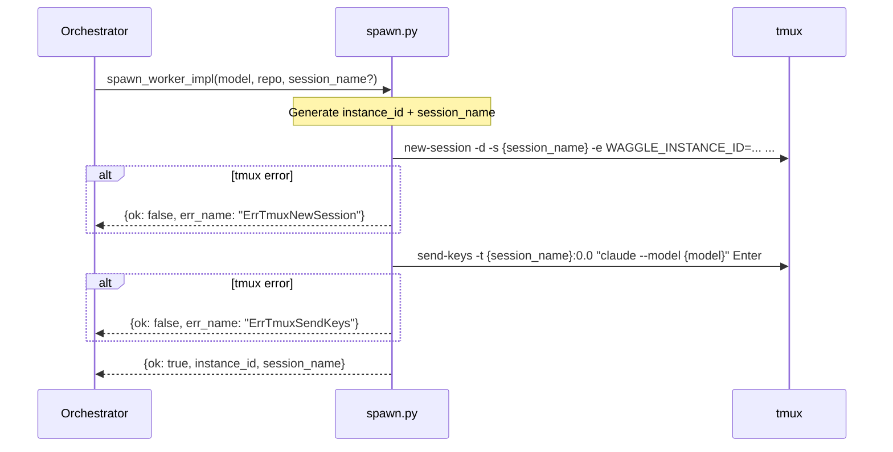

# spawn_worker Architecture

## Overview

`spawn_worker` creates a new tmux session, sets the required Waggle env vars, and launches `claude` inside it.

Implemented in `src/waggle/spawn.py` as `spawn_worker_impl()`. All tmux calls go through the `_tmux(argv)` seam.

## Parameters

| Parameter | Type | Required | Default | Description |
|-----------|------|----------|---------|-------------|
| `model` | `str` | Yes | — | Claude model name (`"sonnet"`, `"haiku"`, `"opus"`) |
| `repo` | `str` | Yes | — | Absolute local path to the working directory |
| `session_name` | `str \| None` | No | `None` | tmux session name; generated as `waggle-{instance_id[:8]}` if omitted |

## Flow

1. **Generate UUID** for `instance_id`
2. **Generate session name** if not provided: `waggle-{instance_id[:8]}`
3. **Create tmux session** via `tmux new-session -d -s {session_name} -e KEY=val ...` — sets 7 required env vars including `WAGGLE_INSTANCE_ID`, `WAGGLE_MODEL`, `WAGGLE_REPO`, etc.
4. **Launch claude** via `tmux send-keys -t {session_name}:0.0 "claude --model {model}" Enter`
5. **Return** `{ok: true, instance_id, session_name}`

## Claude Status integration

Claude Status observes session lifecycle via hooks set by `waggle install`. Workers appear in `claude-status workers` output with the `waggle_owned=1` label.

## Errors

| err_name | Condition |
|----------|-----------|
| `ErrTmuxNewSession` | `tmux new-session` exits non-zero |
| `ErrTmuxSendKeys` | `tmux send-keys` exits non-zero (after session created) |

## Sequence Diagram

