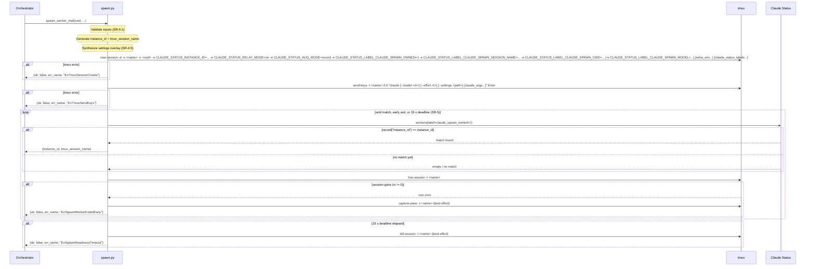

# spawn_worker Architecture

## Overview

`spawn_worker` validates its inputs, synthesizes a settings overlay when needed,
creates a tmux session with the required Claude Spawn env vars injected, and
launches `claude` inside it.

Implemented in `src/claude_spawn/spawn.py` as `spawn_worker_impl()`. All tmux
calls go through the `_tmux(argv)` seam.

## Parameters

| Parameter | Type | Required | Default | Description |
|-----------|------|----------|---------|-------------|
| `template` | `str` | No | None | Named template to load from `~/.claude-spawn/templates/<name>.toml`; resolved options merge with per-call args per SR-2.1 (per-call → template → default) |
| `model` | `str` | No | inherits Claude Code | Claude model name |
| `thinking` | `str` | No | inherits Claude Code | Effort level — one of `low`, `medium`, `high`, `xhigh` |
| `cwd` | `str` | **Yes** | — | Absolute local path (or `~/...`) to the working directory |
| `tmux_session_name` | `str` | No | `<folder>-<instance_id[:8]>` | tmux session name |
| `instance_id` | `str` | No | UUIDv4 | Worker identifier |
| `claude_home` | `str` | No | inherits Claude Code | Override `HOME` for the spawned Claude process |
| `claude_settings` | `str` | No | inherits Claude Code | Path to a Claude settings JSON file; must exist |
| `extra_env` | `dict[str, str]` | No | `{}` | Additional environment variables for the session |
| `claude_status_labels` | `dict[str, str]` | No | `{}` | Extra Claude Status labels (bare key, auto-uppercased and prefixed) |
| `claude_args` | `list[str]` | No | `[]` | Arguments appended verbatim to the `claude` invocation |
| `permissions` | `dict` | No | `{}` | `{"allow": [], "deny": [], "ask": []}` permissions overlay |

## Flow

1. **Load template** (if `template=<name>` supplied) — `templates.load_template(name)` is called
   before any validation. `ErrTemplateNotFound` or `ErrTemplateMalformed` surfaces here and
   aborts the call immediately, before validation runs.
2. **Resolve options** — `_resolve_options()` merges per-call args, template fields, and
   SR-1.3 defaults per SR-2.1 (per-call → template → default).
3. **Validate inputs** — all SR-9.1 checks run before any tmux call (see Errors table).
4. **Generate defaults** — `instance_id` defaults to a fresh UUIDv4; `tmux_session_name`
   defaults to `<sanitize(cwd)>-<instance_id[:8]>`.
5. **Synthesize settings overlay** (SR-4.5) — see Settings Overlay section below.
6. **Create tmux session** via `tmux new-session -d -s <name> -c <cwd> -e KEY=VAL ...`
   — the `-c` flag sets the start directory directly on `new-session`; no `cd` preamble
   is sent via `send-keys`.
7. **Inject env vars** (SR-4.2) — six unconditional vars plus conditionals (see below).
8. **Launch claude** via `tmux send-keys` with the SR-4.4 composed command line.
9. **Readiness wait** (SR-5) — poll `claude_status.workers(label="claude_spawn_owned=1")` every ~100 ms via the `_run` seam. Scan for `record["instance_id"] == <instance_id>` (exact match, SR-10.1). Each iteration also probes `tmux has-session -t <name>`:
   - **Match found** → proceed to return.
   - **Session gone** (non-zero `has-session`) → best-effort `tmux capture-pane` to collect diagnostic output → return `ErrSpawnWorkerExitedEarly` with pane text in `err_description`.
   - **15-second timeout** (`_SPAWN_READINESS_TIMEOUT`) → best-effort `tmux kill-session -t <name>` → return `ErrSpawnReadinessTimeout`.
10. **Return** `{"instance_id": str, "tmux_session_name": str}`.

### Environment variables (SR-4.2)

Six vars are injected unconditionally via `-e` flags on `new-session`:

| Variable | Value |
|----------|-------|
| `CLAUDE_STATUS_INSTANCE_ID` | `<instance_id>` |
| `CLAUDE_STATUS_RELAY_MODE` | `on` |
| `CLAUDE_STATUS_AUQ_MODE` | `record` |
| `CLAUDE_STATUS_LABEL_CLAUDE_SPAWN_OWNED` | `1` |
| `CLAUDE_STATUS_LABEL_CLAUDE_SPAWN_SESSION_NAME` | `<tmux_session_name>` |
| `CLAUDE_STATUS_LABEL_CLAUDE_SPAWN_CWD` | `<expanded cwd>` |

One var is conditional:

| Variable | Emitted when |
|----------|-------------|
| `CLAUDE_STATUS_LABEL_CLAUDE_SPAWN_MODEL` | `model` is set |

`extra_env` key-value pairs are appended as additional `-e KEY=VAL` flags.
`claude_status_labels` entries are appended as `CLAUDE_STATUS_LABEL_<UPPER>=<val>`.
If `claude_home` is set, `HOME=<claude_home>` is also injected.

### Command-line composition (SR-4.4)

```
claude [--model <m>] [--effort <l>] [--settings <path>] [claude_args ...]
```

Flags are emitted only when their resolved option is set:

- `--model <m>` — emitted when `model` is supplied.
- `--effort <l>` — emitted when `thinking` is supplied.
- `--settings <path>` — emitted when an effective overlay path is resolved (see Settings Overlay).

The composed command string is sent via `tmux send-keys ... Enter`.

### Settings overlay (SR-4.5)

Three synthesis paths determine the `--settings` path passed to `claude`:

| Inputs | Result |
|--------|--------|
| `permissions` non-empty, no `claude_settings` | Claude Spawn writes a synthesized temp JSON containing just the `permissions` block; passes it via `--settings` |
| `claude_settings` supplied, `permissions` empty | Caller's file passed verbatim via `--settings` |
| Both `claude_settings` and `permissions` supplied | Claude Spawn writes a composite temp file: caller's file keys pass through; first-class `permissions.allow`/`deny`/`ask` win on those three keys |
| Neither supplied | No `--settings` flag |

Template loading extends this flow when `template=<name>` is supplied — see [`spawn_options_and_templates.md`](./spawn_options_and_templates.md) for the option-resolution chain and merge semantics.

## Claude Status integration

Claude Status observes session lifecycle via hooks set by `claude-spawn install`.
Workers appear in `claude-status workers` output with the `claude_spawn_owned=1` label.

## Errors

| err_name | Condition |
|----------|-----------|
| `ErrCwdMissing` | `cwd` was not supplied or is empty |
| `ErrCwdNotFound` | `cwd` (after `~` expansion) does not exist on disk |
| `ErrCwdNotAPath` | `cwd` is a URL (`://` present) or a relative path |
| `ErrClaudeSettingsNotFound` | `claude_settings` path does not exist on disk |
| `ErrClaudeSettingsMalformed` | `claude_settings` file is unreadable as JSON, or its `permissions` key is present but not a dict (surface: settings overlay synthesis) |
| `ErrInstanceIdCollision` | Caller-supplied `instance_id` matches an active worker |
| `ErrClaudeArgsSettingsConflict` | `--settings` appears in `claude_args` while `claude_settings` or `permissions` is also set |
| `ErrReservedEnvKey` | An `extra_env` key collides with a key Claude Spawn always emits |
| `ErrThinkingInvalid` | `thinking` is not one of `low`, `medium`, `high`, `xhigh` |
| `ErrTmuxSessionCreate` | `tmux new-session` exits non-zero |
| `ErrTmuxSendKeys` | `tmux send-keys` exits non-zero (after session created) |
| `ErrSpawnReadinessTimeout` | `spawn_worker` post-launch: 15 s elapsed with no Claude Status registration; `tmux kill-session` attempted (kill failure does not change the `err_name`) |
| `ErrSpawnWorkerExitedEarly` | `spawn_worker` post-launch: `tmux has-session` probe returned non-zero before registration; `tmux capture-pane` output included in `err_description` |

## Sequence Diagram



## See also

- [Option resolution and templates](./spawn_options_and_templates.md)
