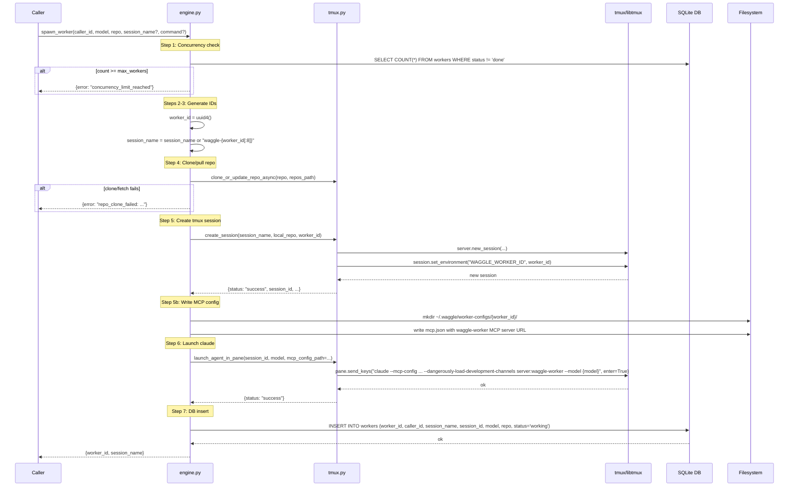

# spawn_worker Architecture

## Overview

`spawn_worker` creates a new worker for a caller: checks concurrency limits, clones the repo if needed, creates a tmux session, writes a per-worker MCP config file, launches claude with Claude Channels support, and records the worker in the database.

Defined in `src/waggle/engine.py`. Delegates tmux operations to `src/waggle/tmux.py`.

## Parameters

| Parameter | Type | Required | Default | Description |
|-----------|------|----------|---------|-------------|
| `caller_id` | `str` | Yes | — | Caller performing the spawn |
| `model` | `str` | Yes | — | Claude model name (e.g. `"sonnet"`, `"haiku"`, `"opus"`) |
| `repo` | `str` | Yes | — | Local path or GitHub HTTPS URL |
| `session_name` | `str \| None` | No | `None` | tmux session name; generated as `waggle-{worker_id[:8]}` if omitted |
| `command` | `str \| None` | No | `None` | Initial command (reserved — Epic 3 adds delivery) |

## Flow

1. **Concurrency check** — count active workers (`status != 'done'`); reject if `>= max_workers`
2. **Generate UUID** for `worker_id`
3. **Generate session name** if not provided: `waggle-{worker_id[:8]}`
4. **Clone/pull repo** if URL via `clone_or_update_repo()`
5. **Create tmux session** via `create_session(session_name, local_repo, worker_id)` — sets `WAGGLE_WORKER_ID` env var
5b. **Write per-worker MCP config** to `~/.waggle/worker-configs/{worker_id}/mcp.json` (see below)
6. **Launch claude** via `launch_agent_in_pane(session_id, model, mcp_config_path=...)` — uses `--mcp-config` and `--dangerously-load-development-channels`
7. **Insert into workers table** (`status = 'working'`)
8. **Return** `{worker_id, session_name}`

## Per-Worker MCP Config

At spawn time, engine writes `~/.waggle/worker-configs/{worker_id}/mcp.json`:

```json
{
  "mcpServers": {
    "waggle-worker": {
      "type": "http",
      "url": "http://localhost:{mcp_worker_port}/mcp?worker_id={worker_id}"
    }
  }
}
```

`mcp_worker_port` comes from `config.get_config()["mcp_worker_port"]` (default `8423`).

This config is passed to claude via `--mcp-config`, enabling the worker to connect to the waggle worker MCP server. Registration is automatic: `WorkerRegistrationMiddleware` intercepts the `tools/list` request fired during MCP client initialization and stores the `ServerSession` in `WorkerRegistry`.

## Claude Launch Flags

`launch_agent_in_pane` builds the following command when `mcp_config_path` is provided:

```
claude --mcp-config {mcp_config_path} --dangerously-load-development-channels server:waggle-worker --model {model}
```

- `--mcp-config` — points claude at the per-worker MCP server config
- `--dangerously-load-development-channels server:waggle-worker` — enables Claude Channels for the `waggle-worker` MCP server, allowing the daemon to push notifications to the worker

## Errors

| Error | Condition |
|-------|-----------|
| `concurrency_limit_reached` | Active worker count >= max_workers |
| `repo_clone_failed` | git clone or fetch/reset failed |
| `invalid_repo` | URL cannot be parsed (no owner/repo path components) |

## Termination

`terminate_worker` (also in `engine.py`) performs cleanup after killing the tmux session:

1. **Delete config directory** — `shutil.rmtree(~/.waggle/worker-configs/{worker_id}, ignore_errors=True)`
2. **Unregister from WorkerRegistry** — `registry.unregister(worker_id)` removes the in-memory MCP session reference

## Sequence Diagram


