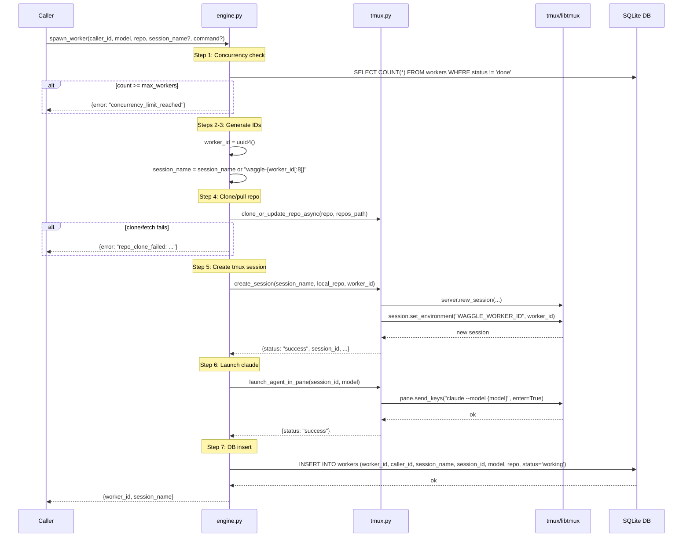

# spawn_worker Architecture

## Overview

`spawn_worker` creates a new worker for a caller: checks concurrency limits, clones the repo if needed, creates a tmux session, launches claude, and records the worker in the database.

Defined in `src/waggle/engine.py`. Delegates tmux operations to `src/waggle/tmux.py`.

## Parameters

| Parameter | Type | Required | Default | Description |
|-----------|------|----------|---------|-------------|
| `caller_id` | `str` | Yes | — | Caller performing the spawn |
| `model` | `str` | Yes | — | Claude model name (e.g. `"sonnet"`, `"haiku"`, `"opus"`) |
| `repo` | `str` | Yes | — | Local path or GitHub HTTPS URL |
| `session_name` | `str \| None` | No | `None` | tmux session name; generated as `waggle-{worker_id[:8]}` if omitted |
| `command` | `str \| None` | No | `None` | Initial command (reserved — Epic 3 adds delivery) |

## Flow

1. **Concurrency check** — count active workers (`status != 'done'`) for caller; reject if `>= max_workers`
2. **Generate UUID** for `worker_id`
3. **Generate session name** if not provided: `waggle-{worker_id[:8]}`
4. **Clone/pull repo** if URL via `clone_or_update_repo()`
5. **Create tmux session** via `create_session(session_name, local_repo, worker_id)` — sets `WAGGLE_WORKER_ID` env var
6. **Launch claude** via `launch_agent_in_pane(session_id, model)`
7. **Insert into workers table** (`status = 'working'`)
8. **Return** `{worker_id, session_name}`

## Errors

| Error | Condition |
|-------|-----------|
| `concurrency_limit_reached` | Active worker count >= max_workers |
| `repo_clone_failed` | git clone or fetch/reset failed |
| `invalid_repo` | URL cannot be parsed (no owner/repo path components) |

> **Epic 3 note**: A future pass will add `--mcp-config` and Claude Channels (`--dangerously-load-development-channels`) to the `launch_agent_in_pane` call.

## Sequence Diagram

