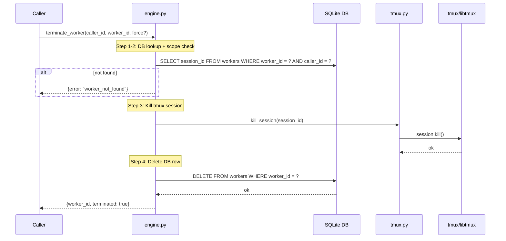

# terminate_worker Architecture

## Overview

`terminate_worker` shuts down a waggle-managed worker: kills the tmux session and removes the worker row from the database.

Defined in `src/waggle/engine.py`. Delegates tmux operations to `src/waggle/tmux.py`.

## Parameters

| Parameter | Type | Required | Default | Description |
|-----------|------|----------|---------|-------------|
| `caller_id` | `str` | Yes | — | Caller requesting termination (scope check) |
| `worker_id` | `str` | Yes | — | UUID of the worker to terminate |
| `force` | `bool` | No | `False` | Reserved for future active-worker protection |

## Flow

1. **DB lookup** — find worker by `worker_id`
2. **Caller scope check** — verify `caller_id` matches the worker's owner; return `worker_not_found` if not (no information leakage)
3. **Kill tmux session** via `kill_session(session_id)`
4. **Delete worker row** from `workers` table
5. **Return** `{worker_id, terminated: True}`

## Errors

| Error | Condition |
|-------|-----------|
| `worker_not_found` | `worker_id` not in DB, or `caller_id` doesn't match |

## Sequence Diagram

