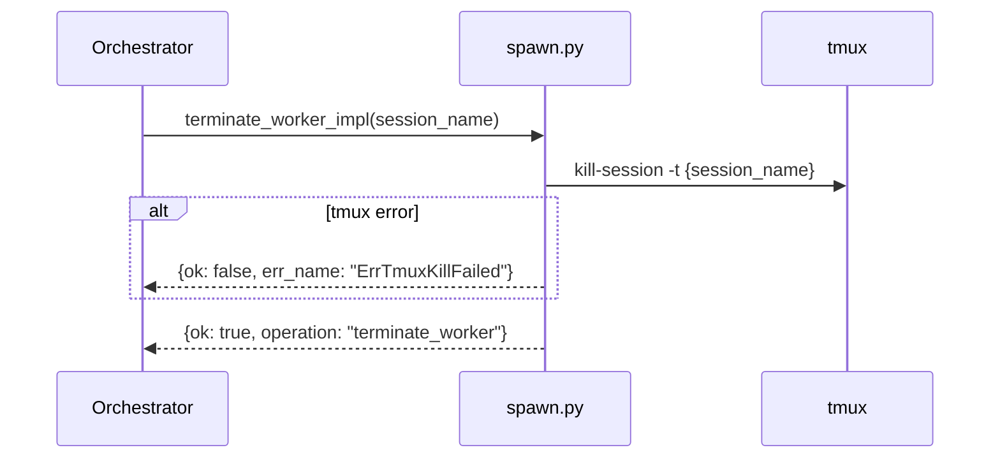

# terminate_worker Architecture

## Overview

`terminate_worker` kills a worker's tmux session via `tmux kill-session`.

Implemented in `src/waggle/spawn.py` as `terminate_worker_impl()`. All tmux calls go through the `_tmux(argv)` seam.

## Parameters

| Parameter | Type | Required | Description |
|-----------|------|----------|-------------|
| `session_name` | `str` | Yes | tmux session name to terminate |

## Flow

1. **Kill tmux session** — `tmux kill-session -t {session_name}`
2. **Return** `{ok: true, operation: "terminate_worker"}`

Claude Status observes the session end via hooks and updates worker state automatically.

## Errors

| err_name | Condition |
|----------|-----------|
| `ErrTmuxKillFailed` | `tmux kill-session` exits non-zero (e.g. session not found) |

## Sequence Diagram

