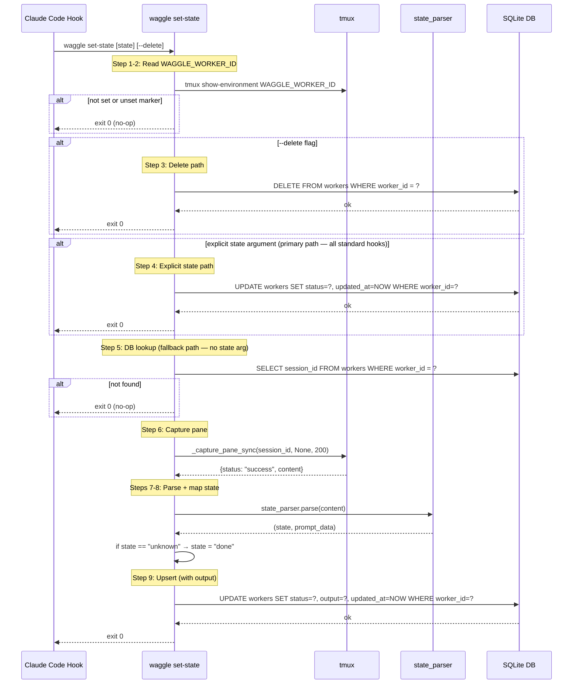

# waggle set-state Architecture

## Overview

`waggle set-state` is a Python CLI subcommand that replaces the v1 bash hook. It is how workers report state back to waggle — called by Claude Code hooks on state-change events.

Defined in `src/waggle/cli.py` (`_handle_set_state`). Reads worker identity from the tmux session environment and updates the worker's state in the `workers` table.

There are two execution paths:
- **Explicit state (primary):** When called with a state argument (e.g., `waggle set-state waiting`), sets `workers.status` directly and exits. All standard hooks use this path — no pane capture or state_parser involved.
- **Fallback (no argument):** When called without a state argument, captures pane output and classifies state via `state_parser.parse()`. Also stores the captured output in `workers.output`.

## CLI Interface

| Invocation | Purpose |
|---|---|
| `waggle set-state` | Capture pane, parse state, update `workers` table |
| `waggle set-state waiting` | Force state to `waiting` (used by hooks) |
| `waggle set-state working` | Force state to `working` (used by hooks) |
| `waggle set-state --delete` | Remove worker row (SessionEnd cleanup) |

### Arguments

| Argument | Type | Required | Default | Description |
|---|---|---|---|---|
| `state` | positional | No | — | Force a specific state (e.g. `waiting`, `working`). If omitted, state is derived from pane capture. |
| `--delete` | flag | No | `False` | Delete the worker row instead of updating it |

## Flow

1. **Read WAGGLE_WORKER_ID** — run `tmux show-environment WAGGLE_WORKER_ID` to get the worker UUID
2. **Not set → exit 0** — if the variable is absent or prefixed with `-` (unset), this is not a waggle session; exit silently
3. **`--delete` path** — if `--delete` flag is set, `DELETE FROM workers WHERE worker_id = ?` and exit 0
4. **Explicit state path (primary)** — if a state argument was provided, `UPDATE workers SET status = ?, updated_at = CURRENT_TIMESTAMP WHERE worker_id = ?` and exit 0; pane capture and state_parser are skipped entirely
5. **DB lookup** — `SELECT session_id FROM workers WHERE worker_id = ?`; if not found, exit 0 (fallback path only)
6. **Capture pane** — call `_capture_pane_sync(session_id, None, 200)` to capture 200 lines of scrollback
7. **Parse state** — call `state_parser.parse(content)` to determine the current agent state
8. **Map unknown → done** — if state_parser returns `unknown`, treat it as `done`
9. **Upsert** — `UPDATE workers SET status = ?, output = ?, updated_at = CURRENT_TIMESTAMP WHERE worker_id = ?` (also stores captured output)

## WAGGLE_WORKER_ID

`WAGGLE_WORKER_ID` is a UUID set in the tmux session environment by `create_session()` in `tmux.py` when the session is spawned. It links the running Claude Code instance back to its row in the `workers` table without relying on tmux session names or window/pane indices.

## State Mapping

`state_parser.parse()` returns a `(state, prompt_data)` tuple. The state value is written directly to `workers.status`, with one exception:

| state_parser result | DB status | Notes |
|---|---|---|
| `working` | `working` | Agent actively processing |
| `done` | `done` | Agent idle at prompt |
| `ask_user` | `ask_user` | Interactive question with options |
| `check_permission` | `check_permission` | Permission confirmation |
| `unknown` | `done` | Fallback — treated as idle |

## Hook Event Mapping

Claude Code hooks invoke `waggle set-state` (and related commands) on the following events:

| Claude Code Event | waggle CLI Invocation | Purpose |
|---|---|---|
| `PermissionRequest` | `waggle permission-request` | Relay permission decision to orchestrator |
| `SessionStart` | `waggle set-state waiting` | Register worker as idle at session open |
| `UserPromptSubmit` | `waggle set-state working` | Mark worker active after user input |
| `PreToolUse` (AskUserQuestion) | `waggle ask-relay` | Relay question to orchestrator |
| `PreToolUse` (other) | `waggle set-state working` | Mark worker active before tool execution |
| `PostToolUse` | `waggle set-state working` | Mark worker active after tool execution |
| `Stop` | `waggle set-state waiting` | Mark worker idle when agent stops |
| `SessionEnd` | `waggle set-state --delete` | Clean up worker row |

## Output Capture

The captured pane content (up to 200 lines of scrollback) is stored in `workers.output`. This allows orchestrators to read worker output via the `check_status` engine function without needing direct tmux access.

## Error Handling

All error paths exit 0 silently. The outer `try/except Exception: pass` block at the bottom of `_handle_set_state` ensures that any failure — database errors, import errors, tmux errors — is swallowed. Hooks must never break the Claude Code session.

## v1 → v2 Changes

| | v1 | v2 |
|---|---|---|
| Implementation | bash hook | Python CLI (`waggle set-state`) |
| Worker identity | Composite key from tmux session info | `WAGGLE_WORKER_ID` UUID |
| SQL safety | Manual string sanitization | Parameterized queries via `database.connection()` |
| Database table | `state` table | `workers` table |

## Sequence Diagram

